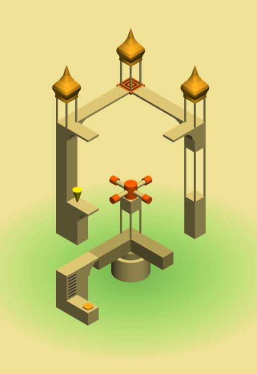
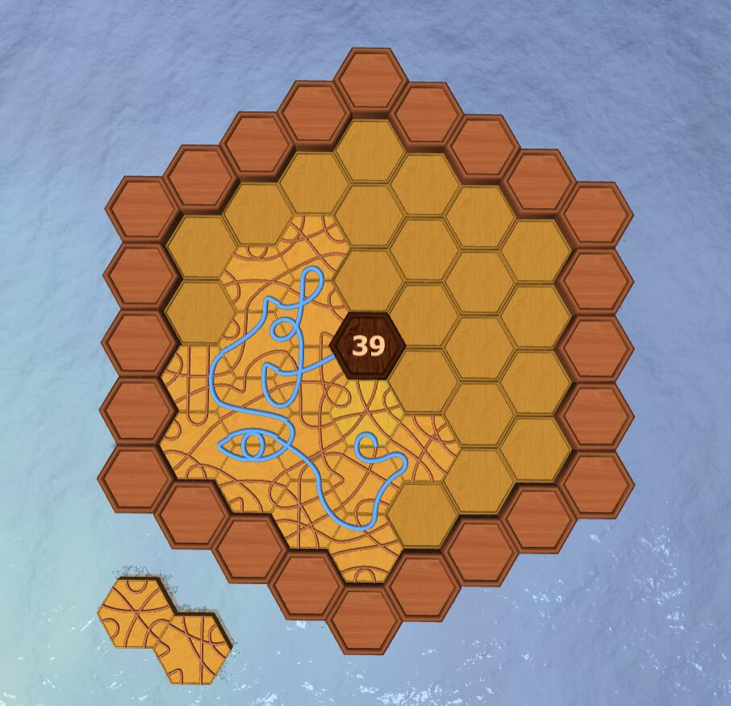
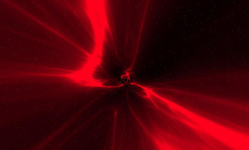
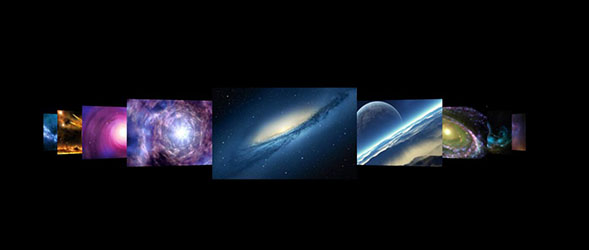

# ThreeQuery
基于Three.js的3D框架，支持移动设备以及VR效果
 
## 核心思想：没必要进行额外的封装，只让使用three.js常用功能变得更加轻松容易。

### 文档地址

https://hypnosnova.github.io/ThreeQuery/docs

### 各种基础和高级demo地址

https://hypnosnova.github.io/ThreeQuery/gallery

### 原生WebGL实例地址

https://hypnosnova.github.io/ThreeQuery/pureWebgl

